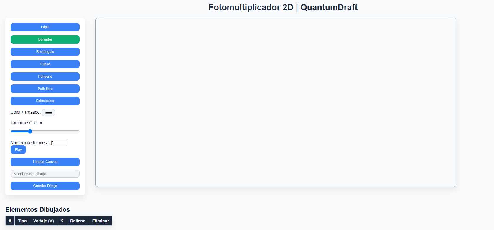
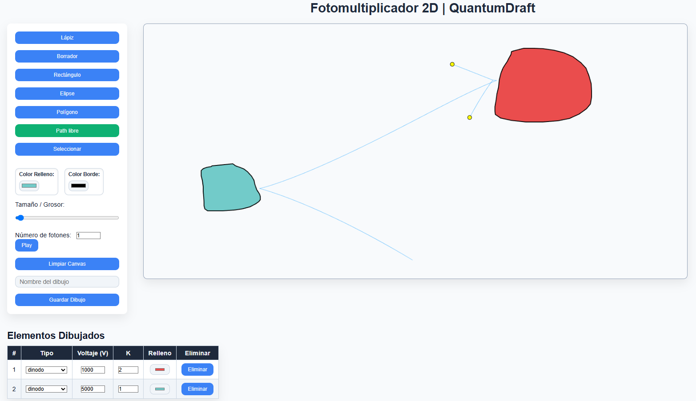

<!-- Badges -->

[](#licencia)
[](#versi%C3%B3n)

# QuantumDraft

**Simulador de Fotomultiplicador 2D**
Dibuja componentes, asignales voltaje y factor de multiplicación, y visualiza el comportamiento de fotones bajo interacción electromagnética.

---

## 📸 Capturas de pantalla

<p align="center">
  
  
</p>

---

## 🚀 Características principales

* **Herramientas de dibujo**: lápiz, borrador, rectángulo, elipse, polígono y trazado libre.
* **Selección y edición**: mueve, redimensiona y gira formas; modifica colores y grosor en tiempo real.
* **Simulación de fotones**: los fotones se ven atraídos por los objetos cargados, rebotan en bordes y colisionan físicamente.
* **Multiplicación de fotones**: asigna factor *K* a los “dinodos” para generar nuevos fotones aleatorios tras la colisión.
* **Persistencia**: guarda capturas PNG de tus dibujos en `saved_drawings/` junto con metadatos JSON y un registro CSV.
* **Responsive & moderno**: interfaz basada en CSS moderno, animaciones suaves y adaptabilidad móvil.

---

## 📁 Estructura del proyecto

```
QuantumDraft/
├── .gitignore
├── README.md
├── agustin.txt                # Notas internas
├── funciones.js               # Lógica principal de dibujo y simulación
├── index.html                 # Interfaz web
├── ramas.m                    # (Opcional) script MATLAB
├── save_canvas.php            # API para persistir imágenes
├── saved_drawings/            # Carpeta con dibujos guardados, JSON y CSV
└── style.css                  # Estilos y layout
```

---

## 🔧 Instalación y uso

1. **Clona el repositorio**

   ```bash
   git clone https://github.com/tu_usuario/QuantumDraft.git
   cd QuantumDraft
   ```

2. **Configura un servidor local**
   Usa [XAMPP](https://www.apachefriends.org/) (u otro) para servir `index.html` y procesar `save_canvas.php`.
   Copia la carpeta a `D:/xampp/htdocs/QuantumDraft`.

3. **Abre la aplicación**
   En tu navegador, visita

   ```
   http://localhost/QuantumDraft/
   ```

4. **Dibuja tus componentes**

   * Selecciona herramienta
   * Dibuja en el canvas
   * Ajusta colores, grosor y parámetros de cada forma en la tabla
   * Para “dinodo”, edita también el factor *K* y el voltaje.

5. **Simula fotones**

   * Indica el número de fotones (0–5)
   * Haz clic en **Play** para iniciar la animación
   * Observa cómo se atraen, rebotan y multiplican.

6. **Guarda tu trabajo**

   * Introduce un **nombre**
   * Pulsa **Guardar Dibujo**
   * Encuentra el PNG, JSON y un registro en `saved_drawings/`.

---

## 🛠️ Estructura del código

* **funciones.js**

  * Clase `Photon`: dibuja y actualiza el comportamiento de cada fotón (atracción, colisión, rebote, multiplicación).
  * Manejadores de eventos del canvas para dibujo libre, figuras y selección.
  * Lógica de **redraw**, **hitTest**, **handles** y **rotación**.
  * Generación de fotones y bucle de animación `requestAnimationFrame`.

* **index.html**

  * Disposición en **tres columnas**: controles, canvas y tabla de información.
  * Referencias a `style.css` y `funciones.js`.

* **save\_canvas.php**

  * Recibe imagen en Base64 y nombre, la decodifica y guarda como PNG.
  * Genera metadatos JSON y registra en `drawings.csv`.

* **style.css**

  * Variables CSS para colores, sombras y tipografía.
  * Grid flexible, animaciones de entrada y estilos responsivos.

---

## 📄 Licencia

Este proyecto está bajo la licencia MIT. Consulta el archivo [LICENSE](LICENSE) para más detalles.

---

## 🙌 Contribuciones

¡Toda contribución es bienvenida!

1. Haz un *fork* del repositorio.
2. Crea una rama: `git checkout -b feature/nombre-de-la-rama`.
3. Realiza tus mejoras y haz *commit*: `git commit -m \"Añade nueva funcionalidad X\"`.
4. Envía tus cambios: `git push origin feature/nombre-de-la-rama`.
5. Abre un *Pull Request* en GitHub.

---

## 🤝 Contacto

* **Autor**: Agustín Morcillo
* **Email**: [agustin.morcillo1912@gmail.com](mailto:agustin.morcillo1912@gmail.com)
* **Web**: [https://tu-sitio-web.com](https://tu-sitio-web.com)

---

¡Gracias por usar **QuantumDraft**!
